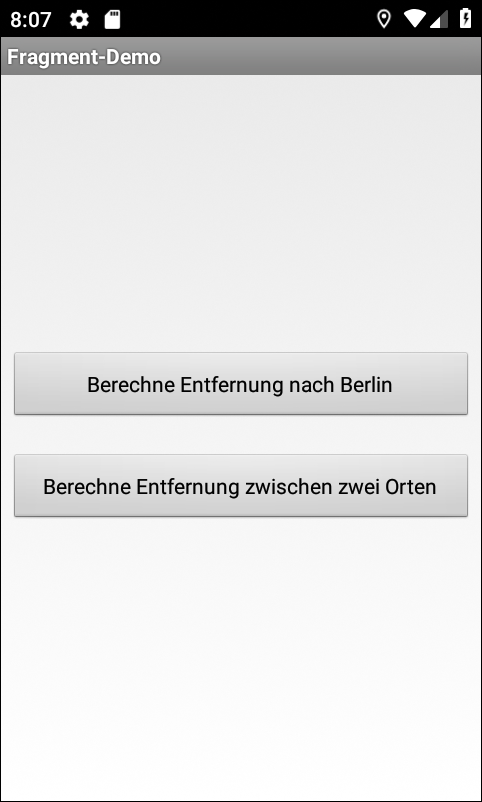
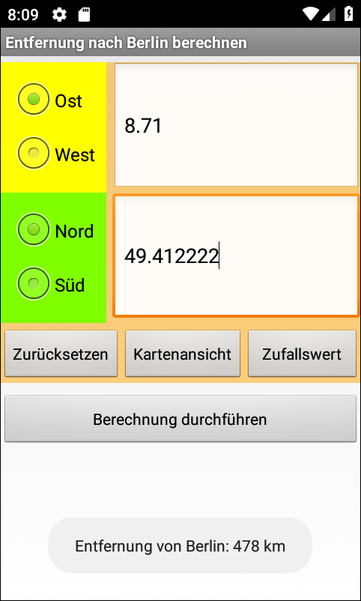
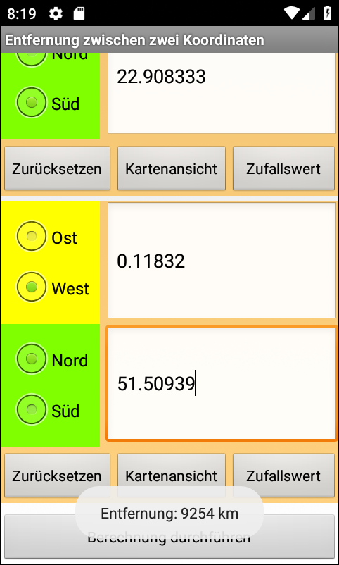

# Android-App "Fragments"

Simple Android app that shows how to use [fragments](https://developer.android.com/guide/components/fragments). 
Fragments are re-usable UI components consisting of several view elements.
The fragment in this example is for entering one geographic coordinate (e.g. 51.507222° North and 0.1275° West for
[London](https://tools.wmflabs.org/geohack/geohack.php?pagename=London&params=51_30_26_N_0_7_39_W_region:GB_type:city(8825000))). 

 

Identifiers (names for classes, variables and methods), UI text and (JavaDoc) comments are in German only.

 

----
## Screenshots

  

 

The screenshots were taken from the app running in the Android SDK's emulator.

 

----
# License

See the [LICENSE file](LICENSE.md) for license rights and limitations (BSD 3-Clause License).
