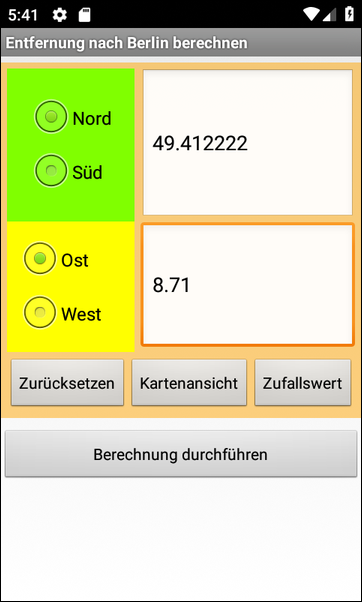
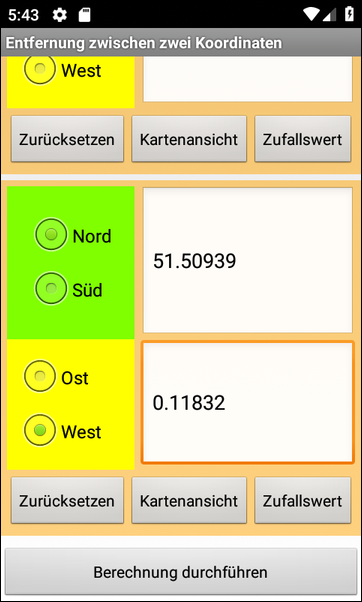

# Android-App "Fragments" #

 

Dieses Repository enthält ein Android-Studio-Projekt für eine native Android-App mit Java, die
die Verwendung von [Fragmenten](https://developer.android.com/guide/components/fragments)
demonstriert.
Fragmente sind wiederverwendbare UI-Komponenten, die aus verschiedenen UI-Elementen bestehen und
auch eigene Logik enthalten können.
Im vorliegenden Fall wird ein Fragment gezeigt, in das man geografische Koordinaten
(z.B. 51.507222° N and 0.1275° W für
[London](https://tools.wmflabs.org/geohack/geohack.php?pagename=London&params=51_30_26_N_0_7_39_W_region:GB_type:city(8825000))) eingeben kann.

 

Siehe auch [dieses Repo](https://github.com/MDecker-MobileComputing/Android_Kalorienrechner) für eine andere Beispiel-App zu Fragmenten.

 

----

## Screenshots ##

 

 &nbsp; 

 

----

## License ##

 

See the [LICENSE file](LICENSE.md) for license rights and limitations (BSD 3-Clause License).

 
